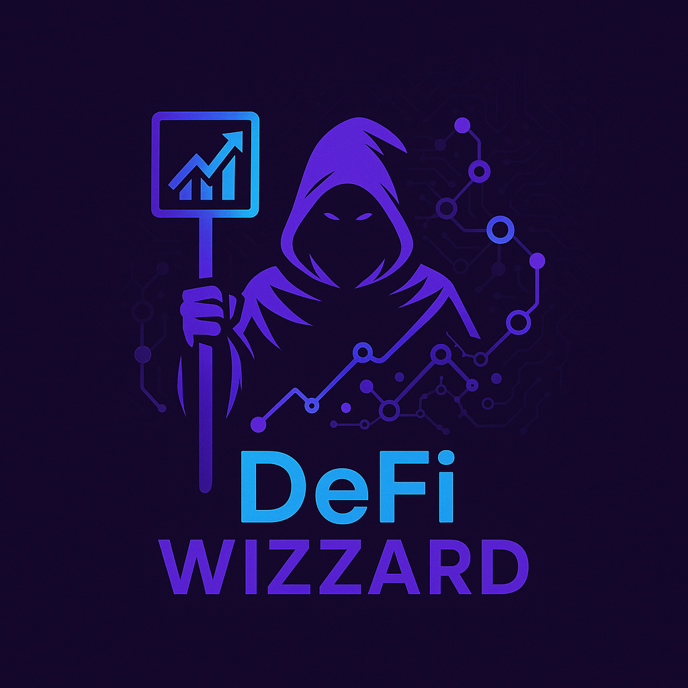
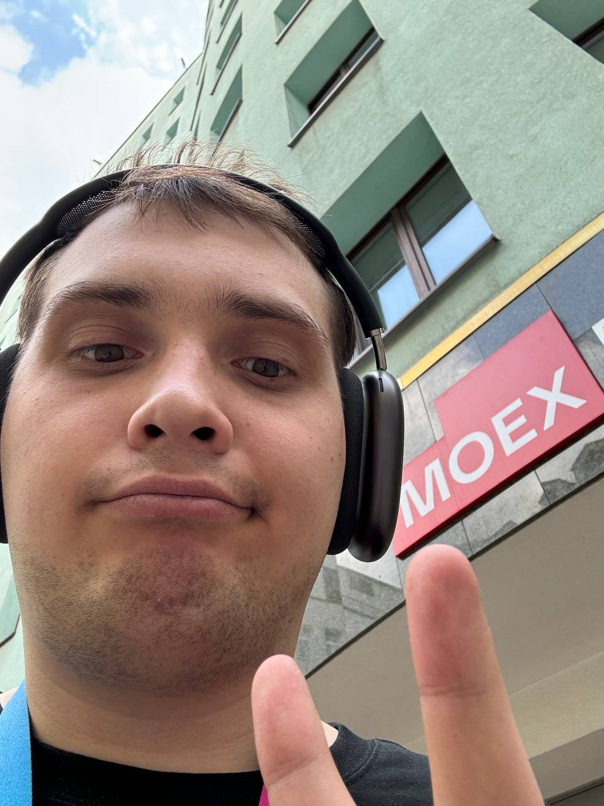

  

# De-Fi Wizzard | Web3: Интеллектуальный помощник для инвестиций в мире децентрализованных финансов! 🚀

# Содержание 📑
- [Обзор](#обзор-🌐)
- [Основные Компоненты 🛠️](#основные-компоненты-🛠️)
  - [🤖 AI-Агенты](#🤖-ai-агенты)
  - [🔍 Парсеры и Аналитика](#🔍-парсеры-и-аналитика)
  - [⚙️ Финансовое Ядро и Умные Контракты](#⚙️-финансовое-ядро-и-умные-контракты)
  - [💻 Пользовательский Интерфейс](#💻-пользовательский-интерфейс)
- [Почему Это Важно? 💡](#почему-это-важно-💡)
- [Наша Команда 👥](#наша-команда-👥)

## Обзор 🌐
**DeFi AI Платформа** – это AI-powered система для автоматизированного управления инвестициями в сфере децентрализованных финансов.  
Мы помогаем:
- Автоматически анализировать новости, соцмедиа и ончейн-данные 📰
- Принимать обоснованные инвестиционные решения на основе персонализированных рекомендаций 🤖
- Упростить работу с различными DeFi-протоколами и блокчейнами в одном интерфейсе 🔗

## Основные Компоненты 🛠️

  
🤖 AI-Агенты

  <ul>
    <li><strong>Обработка новостей и соцмедиа:</strong> Выявляют рыночные тренды и аномалии для оперативного реагирования.</li>
    <li><strong>Анализ ончейн-данных:</strong> Отслеживают TVL, объемы торгов, транзакции и другие ключевые метрики.</li>
    <li><strong>Интерактивный чат-бот:</strong> Общается с пользователем на естественном языке, принимает команды и дает рекомендации.</li>
  </ul>

  
🔍 Парсеры и Аналитика

  <ul>
    <li><strong>Сбор данных из мультиисточников:</strong> Интеграция с различными блокчейнами, новостными агрегаторами и API.</li>
    <li><strong>Анализ в реальном времени:</strong> Автоматизированная оценка риска, динамики рынка и состояния активов.</li>
    <li><strong>Персональный мониторинг:</strong> Визуализация портфеля с графиками, диаграммами и актуальными уведомлениями.</li>
  </ul>

  
⚙️ Финансовое Ядро и Умные Контракты

  <ul>
    <li><strong>Автоматизация инвестиций:</strong> Динамическое распределение ликвидности в AMM-пулы с поддержкой автокомпаундинга и ребалансировки.</li>
    <li><strong>Интеграция с лендинговыми протоколами:</strong> Возможность заимствования активов для повышения доходности.</li>
    <li><strong>Динамическое управление:</strong> Смарт-контракты, управляемые AI, действуют в интересах пользователя по предзаданным стратегиям.</li>
    <li><strong>Мультичейн архитектура:</strong> Обеспечивает работу с несколькими блокчейнами и свободное перемещение капитала между сетями.</li>
  </ul>

  
💻 Пользовательский Интерфейс

  <ul>
    <li><strong>Умный дашборд:</strong> Отображает динамику портфеля, аллокацию активов, аналитические графики и предупреждения о рисках.</li>
    <li><strong>Интерактивный чат-бот:</strong> Принимает команды, объясняет рекомендации и отвечает на вопросы пользователя.</li>
    <li><strong>Персонализация:</strong> Рекомендации адаптированы под риск-профиль, цели и историю операций каждого пользователя.</li>
  </ul>

## Почему Это Важно? 💡
- **Простота:** Устраняем сложности традиционных DeFi-платформ, делая инвестиции доступными даже для новичков.
- **Автоматизация:** Снижение риска человеческой ошибки и экономия времени за счёт автоматического исполнения стратегий.
- **Доступность:** Объединяем инструменты анализа, управления и мониторинга активов в одной системе.
- **Гибкость и масштабируемость:** Поддержка множества блокчейнов и протоколов позволяет легко адаптироваться к изменениям рынка.

---

## Наша Команда 👥

  
👨‍💻 Богомолов Иван

  <h2><strong>Роль:</strong> Team Lead | Web3-dev | Backend-dev</h2>
  
<strong>Что делал:</strong> Руководил проектом и координировал командную работу, разрабатывал архитектуру системы и интегрировал ключевые компоненты. Создавал и внедрял smart-contract'ы для взаимодействия с DeFi протоколами, а также разрабатывал серверную часть с использованием LLM AI агентов. Проектировал и оптимизировал парсеры для сбора данных с различных блокчейнов и внешних источников.

  
<strong>Контакты:</strong> <a href="https://t.me/donqhomo">Telegram</a> 📧

  

  
👨‍💻 Мартынов Михаил

  <h2><strong>Роль:</strong> Analytic | Backend-dev</h2>
  
<strong>Что делала:</strong> Занимался разработкой и оптимизацией серверной части, обеспечивал интеграцию с блокчейн-протоколами для обеспечения точности и безопасности транзакций. Проводил глубокий анализ on-chain данных для построения точных финансовых и аналитических метрик. Также занимался внедрением и настройкой Yandex-Lens для создания динамичных финансовых визуализаций и анализа данных.

  
<strong>Контакты:</strong> <a href="https://t.me/mixalight">Telegram</a> 📧

  

  
👨‍💻 Быта Даниэль

  <h2><strong>Роль:</strong> Frontend-dev </h2>
  
<strong>Что делала:</strong> Разрабатывал пользовательский интерфейс и обеспечивал высококачественный пользовательский опыт (UX/UI). Интегрировал систему с API и Web3-кошельками для предоставления удобного и безопасного взаимодействия с блокчейнами. Также активно тестировал систему, обеспечивая её стабильность и взаимодействие с внешними компонентами.

  
<strong>Контакты:</strong> <a href="https://t.me/bytadaniel">Telegram</a> 📧

  

  
👨‍💻 Епифанцев Сергей

  <h2><strong>Роль:</strong> Бизнес аналитик </h2>
  
<strong>Что делал:</strong> Анализировал рынок и финансовую составляющую проекта, разрабатывал бизнес-модели, проводил расчет стоимости токенов, оценивал финансовые риски и прибыльность различных стратегий. Занимался составлением финансовых прогнозов, анализом ценовых колебаний и проработкой подходов для эффективного распределения ресурсов.

  
<strong>Контакты:</strong> <a href="https://t.me/mrzzz23">Telegram</a> 📧

  

---

*Начните оптимизировать свои DeFi-инвестиции уже сегодня!* 🎉

